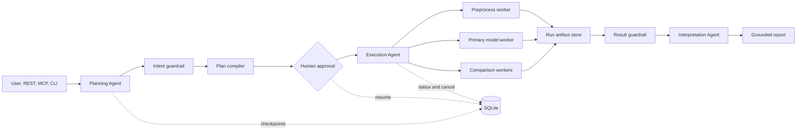

# EPSpec Agents

EPSpec Agents is the stateful multi-agent application layer for **EPSpec: An Evidence-Guided, Prior-Retrieval Agent for Near-Infrared Spectral Band Selection**. It turns the paper's agent description into an executable, inspectable runtime while keeping the published chemometric algorithms unchanged.

The application uses three explicit roles:

1. The **Experiment Planning Agent** converts multilingual requests into a strict experiment intent.
2. The **Scientific Execution Agent** invokes the published deterministic algorithms in isolated worker processes.
3. The **Scientific Interpretation Agent** creates a metric-grounded report from validated artifacts.

LangGraph provides the durable control plane, human approval, checkpointing, and resume semantics. The OpenAI Agents SDK provides typed planning and interpretation agents. Algorithm execution remains deterministic Python rather than being delegated to an LLM.

## Architecture



Every run receives an immutable `run_id`. Its plans, worker requests, model outputs, logs, events, result, report, hashes, and manifest are placed under `Agents/runs/<run_id>`. Inputs and published algorithm source files outside `Agents` are treated as read-only contracts.

## Capabilities

- Pydantic-validated planning and scientific result contracts
- Role-specific model providers and credentials
- OpenAI Agents SDK structured outputs
- LangGraph state graph with SQLite checkpoints
- Clarification and plan-approval interrupts that resume across processes
- Isolated subprocess execution with timeouts and cooperative cancellation
- Parallel comparison-model execution with bounded concurrency
- Strict input/output path guardrails
- Local event stream with secret redaction
- SHA-256 artifact inventory, source hashes, prompt hashes, package versions, and Git provenance
- REST API with OpenAPI and server-sent events
- Model Context Protocol server
- Full CLI lifecycle including status, resume, cancel, artifacts, report, doctor, and evaluation
- Credential-free deterministic demo mode
- Docker and Docker Compose deployment assets
- Backward-compatible launchers for the original three-agent example

## Install

Run commands from this directory.

```bash
python -m venv .venv
.venv/Scripts/python -m pip install -e ".[dev]"
```

On Linux or macOS, use `.venv/bin/python`.

Copy `.env.example` to `.env`, then configure the providers required by the selected mode. The paper-aligned defaults use `glm-4.7` for planning and interpretation and `gpt-5.2` for scientific interval ranking. Each role can use a separate key and compatible base URL.

When the package is launched outside the repository, set `EPSPEC_AGENTS_DIR` to the absolute `Agents` directory and `EPSPEC_PROJECT_ROOT` to the repository root. Source launches from the repository discover both paths automatically.

Verify the environment:

```bash
python -m epspec_agents doctor
```

## Credential-free demo

```bash
python -m epspec_agents demo
```

The demo exercises the complete graph, approval policy, concurrent execution, parsing, report grounding, manifests, and artifact layout. It uses deterministic simulated metrics and labels every result as simulated. It does not reproduce or replace the paper's scientific experiments.

## Native run

```bash
python -m epspec_agents run "Run EPSpec_plsr on shootout and compare plsr, ipls_plsr, and cars_plsr."
```

The graph pauses before execution so the compiled plan can be reviewed. Use `--approve` for trusted non-interactive environments.

```bash
python -m epspec_agents run --approve "在 corn 上运行 EPSpec，并与 PLSR、iPLS 和 CARS 对比。"
```

Useful lifecycle commands:

```bash
python -m epspec_agents list
python -m epspec_agents status RUN_ID
python -m epspec_agents resume RUN_ID approve
python -m epspec_agents cancel RUN_ID
python -m epspec_agents events RUN_ID
python -m epspec_agents artifacts RUN_ID
python -m epspec_agents report RUN_ID
```

## REST API

```bash
python -m epspec_agents serve --host 127.0.0.1 --port 8000
```

OpenAPI is available at `http://127.0.0.1:8000/docs`. Set `EPSPEC_SERVER_TOKEN` to require either `Authorization: Bearer <token>` or `X-EPSpec-Token` on `/v1` routes.

Create a credential-free background run:

```bash
curl -X POST http://127.0.0.1:8000/v1/runs \
  -H "Content-Type: application/json" \
  -d @configs/demo.json
```

## MCP server

```bash
python -m epspec_agents mcp --transport stdio
```

The server exposes capabilities, plan, run, status, resume, cancel, report, artifact-inventory, and event-stream tools. It can be connected to any MCP-compatible host.

For the MCP Python SDK v2 Streamable HTTP transport:

```bash
python -m epspec_agents mcp --transport streamable-http --host 127.0.0.1 --port 8000
```

The endpoint is `/mcp`; the HTTP mode is stateless and uses JSON responses for horizontal scalability. Legacy SSE is intentionally not exposed.

## Deployment

Build from the repository root because the runtime reads the published algorithms and data as read-only inputs.

```bash
docker build -f Agents/Dockerfile -t epspec-agents .
docker compose -f Agents/docker-compose.yml up --build
```

The default Compose profile is offline and simulated so the service can pass a deployment smoke test without secrets. Switch the environment to native mode for scientific execution.

## Quality gates

```bash
python -m pytest
python -m pytest --cov=epspec_agents --cov-branch --cov-report=term-missing
python -m ruff check .
python -m mypy epspec_agents
python -m epspec_agents eval
python -m build
```

See [Architecture](docs/ARCHITECTURE.md), [Operations](docs/OPERATIONS.md), [Reproducibility](docs/REPRODUCIBILITY.md), and [Security](docs/SECURITY.md) for the full engineering contract.

## Scope

The `Agents` directory is an application and reproducibility layer. It does not alter the paper's core spectral evidence construction, prior retrieval, interval ranking, or regression implementations. Scientific validity continues to depend on native execution, the published datasets, configured model provider, and the paper's evaluation protocol.

## Citation

```bibtex
@article{gu2026epspec,
  title = {EPSpec: An Evidence-Guided, Prior-Retrieval Agent for Near-Infrared Spectral Band Selection},
  author = {Gu, Shenghao and Hong, Mingjian},
  journal = {Journal of Chemometrics},
  volume = {40},
  pages = {e70167},
  year = {2026},
  doi = {10.1002/cem.70167}
}
```
