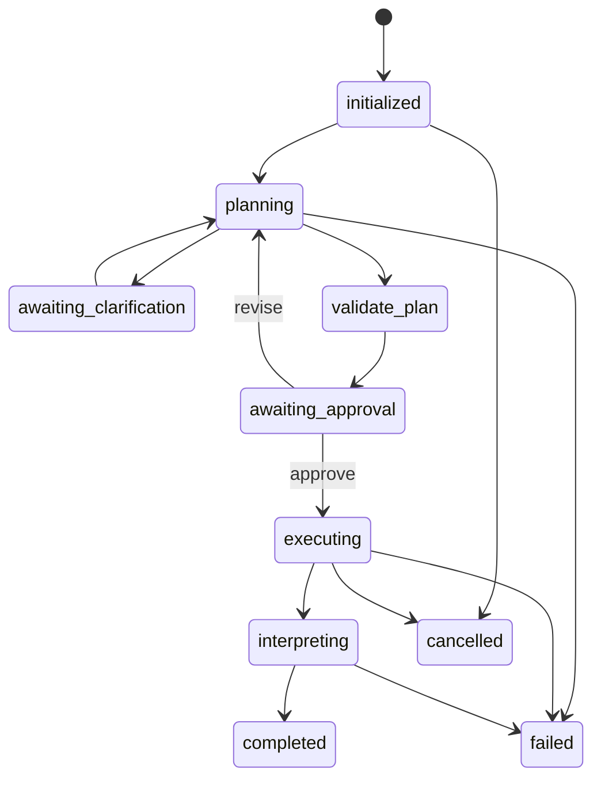

# Architecture

## Design boundary

EPSpec's scientific contribution is an evidence-guided prior-retrieval pipeline. The agent runtime wraps that pipeline without redefining it. Planning and interpretation are probabilistic, typed agent tasks. Preprocessing, interval evidence construction, prior retrieval, ranking integration, regression, and metric production remain algorithm tools with explicit entry points.

## Control plane and data plane

The control plane is a LangGraph `StateGraph`. It owns lifecycle transitions, validation, approval, durable checkpoints, failure routing, and cancellation. The data plane consists of isolated Python workers that import one published algorithm entry point and write only to a run-scoped output directory.



Each LangGraph thread uses the same identifier as the application run. Checkpoints are stored in `.runtime/checkpoints.sqlite`; queryable run summaries are stored separately in `.runtime/runs.sqlite`. Separating graph checkpoints from the API projection keeps runtime status queries small and stable.

## Agent contracts

The Planning Agent emits `PlanningOutput`, either a complete `ExperimentIntent` or one minimal clarification. It cannot create paths or invoke algorithms.

The Execution Agent receives only a validated `ExperimentPlan`. Its registry stores capability metadata instead of importing scientific modules into the control process. Each invocation is serialized to a worker request and executed in a fresh interpreter.

The Interpretation Agent receives `ExperimentResult`, never raw worker logs. Its report is rejected when a named quantitative metric cannot be grounded in the structured results.

## Runtime patch boundary

The published EPSpec scripts contain deployment placeholders for model credentials, provider URL, model name, and prior-knowledge path. The worker supplies these values at runtime in memory. It does not rewrite the published source. Scientific keys are inherited through the worker environment and are excluded from worker payloads, events, and manifests.

## Artifact contract

Each run directory may contain:

```text
runs/<run_id>/
  events.jsonl
  request.json
  plan.json
  experiment_result.json
  manifest.json
  logs/
  prompts/
  report/
  results/
  work/
  workers/
```

Atomic writes are used for runtime-owned JSON and text artifacts. The manifest records file hashes, algorithm source hashes, prompt hashes, input hash, package versions, provider configuration without secrets, and Git revision.

## Extension points

New scientific tools are added as `ToolSpec` metadata in the registry. New orchestration providers implement `StructuredModelAdapter`. Storage can be migrated from the local SQLite repository to a service-backed implementation while preserving `RunSnapshot`. The graph state uses optional fields so new nodes and fields can be introduced without changing algorithm contracts.
